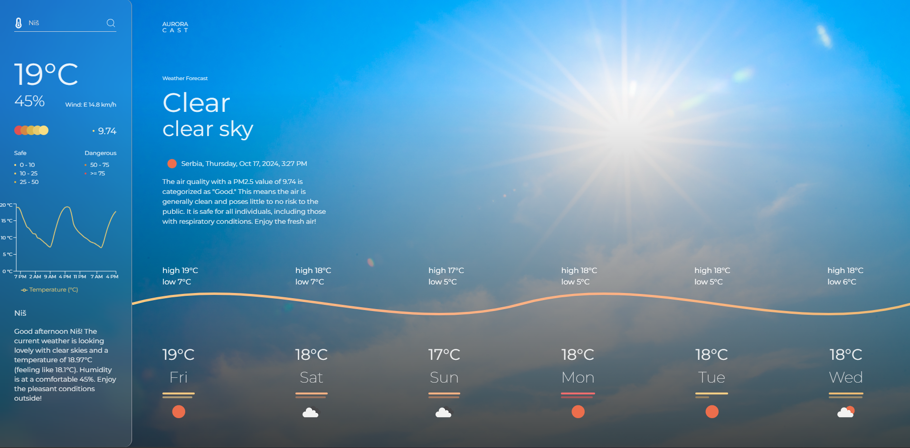
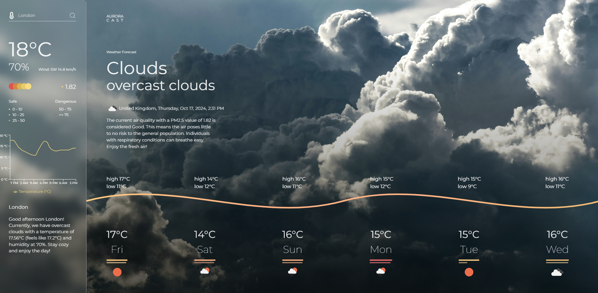

<p align="center" width="100%">
  
</p>

## About the project

This AI-powered app provides real-time weather summaries by integrating the OpenWeather and OpenAI APIs. It allows users to search for weather information based on their location using the Google Geocode API. The app offers accurate and user-friendly weather updates, making it easy to check the current conditions wherever you are!


<p align="center" width="100%"> 
  
</p>
<p align="center" width="100%"> 
  
</p>

## Installation

1. Clone the repo

  ```
    https://github.com/AmauriMarcos/aurora.git
  ```

2. Install NPM packages

   ```
   npm install
   ```
   
3. Go to the project folder

   ```
    cd aurora
   ```

4. Start the project

   ```
   npm run dev
   ```
